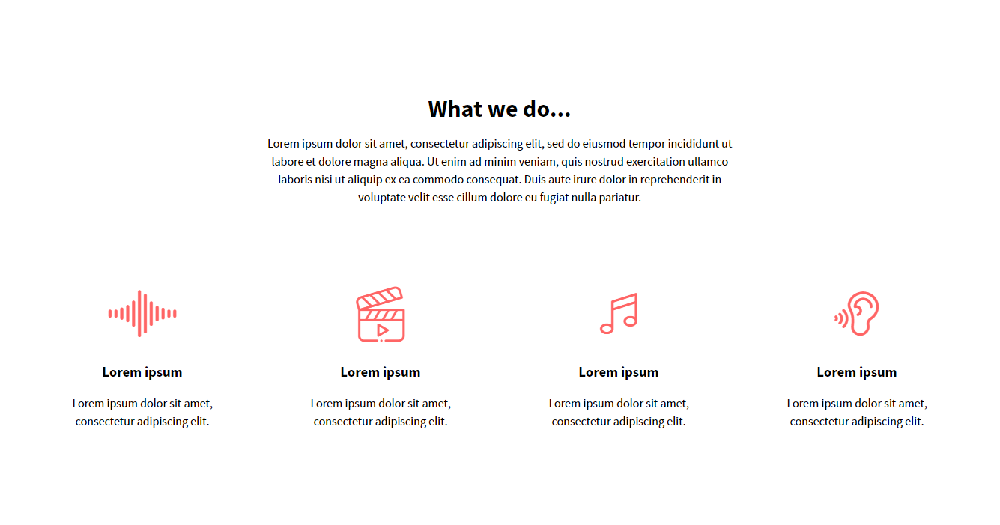
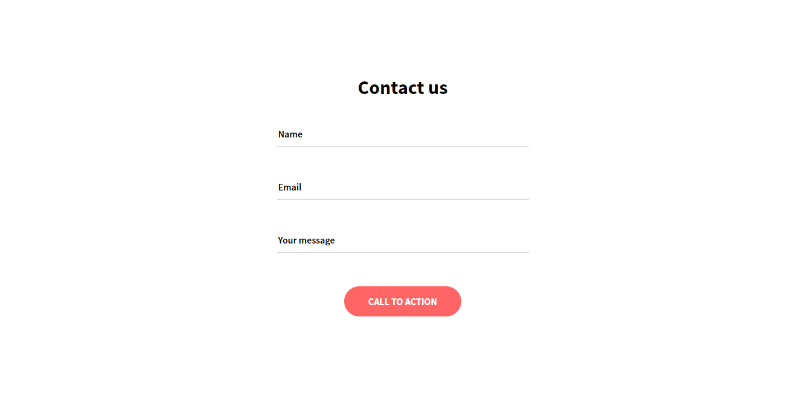

# Holberton Headphones 🎧
This is an example of a web responsive page with the purpose to improve Holberton students skills using HTML an CSS.

## Objetives ☑

* Make different tasks that referrer with each section of a page.
* It should be responsive in different devices, not only a desktop of a computer.
* Doesn't have to use any CSS framework (like Bootstrap) or javascript code.
* Design each section like the Intranet and Figma examples.

## Sections 🎬
Each task is divided in different parts of a web page we need to create and implementing the corresponding styles

### Header - nav items
This first part contains the logo of the brand/company and the different anchors to access directly each section

### Hero section
This is the first view for each user, its have a short description and an action to be covered always related with the main purpose of a web page

### What we do
Here we have an entire description of a product/service to do, offering different options to the user.

### Our results
This part is to show testimonials that verify the quality of the product/service to offer

### Contact us
Here the user can fill a little form if it needs to be contacted in a future.

### Footer
This last section have the social media related with brand/company for user have more information.

## Responsive views 📱
Here is a sample of each section of how it would appear in other devices.
### Mobile view

### Tablet view

## Animations ↻↺
This project has a little demonstration of animations:
* Nav icon become X symbol when it clicked on
* "what we do" section icons changes color and rotates 5 degrees to the right and left
* "Our results" section pentagons changes color and rotates 5 degrees to the right and left
  
  

## Authors ✍
* Cristian Pinzón - Holberton Student C14, Bogotá Colombia.

